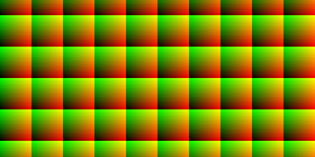
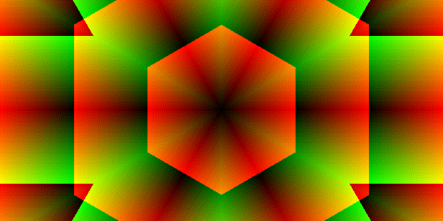
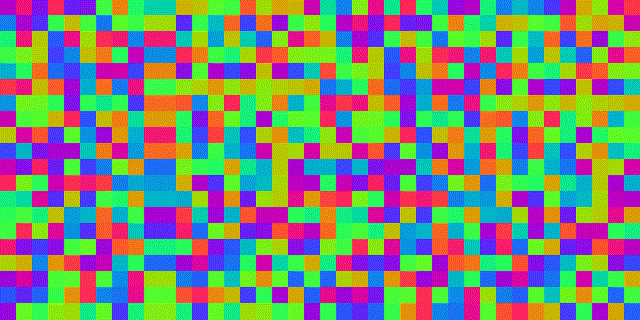
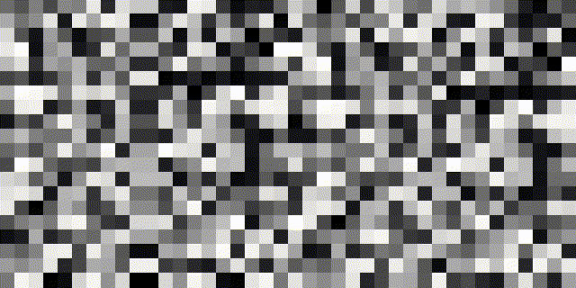
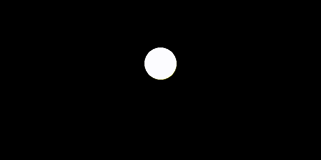
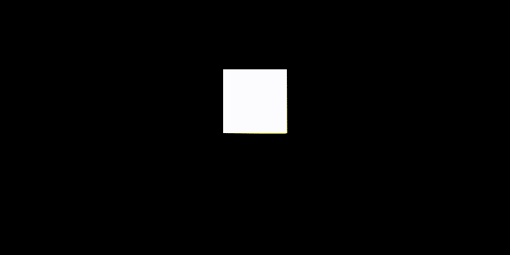

# Basic shaders

## UV coordinates

`base_uv`

`rotate_uv`

`spiral_uv`

`spiral2_uv`

`kaleidoscope_uv`

`lens_uv`

## Texture generation

`perlin_noise`

`perlin_noise_color`

`random_color`

`random_grayscale_color`

## Basic shapes

`circle_shape`

`square_shape`

